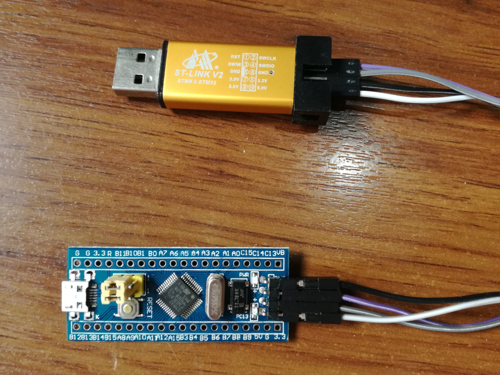
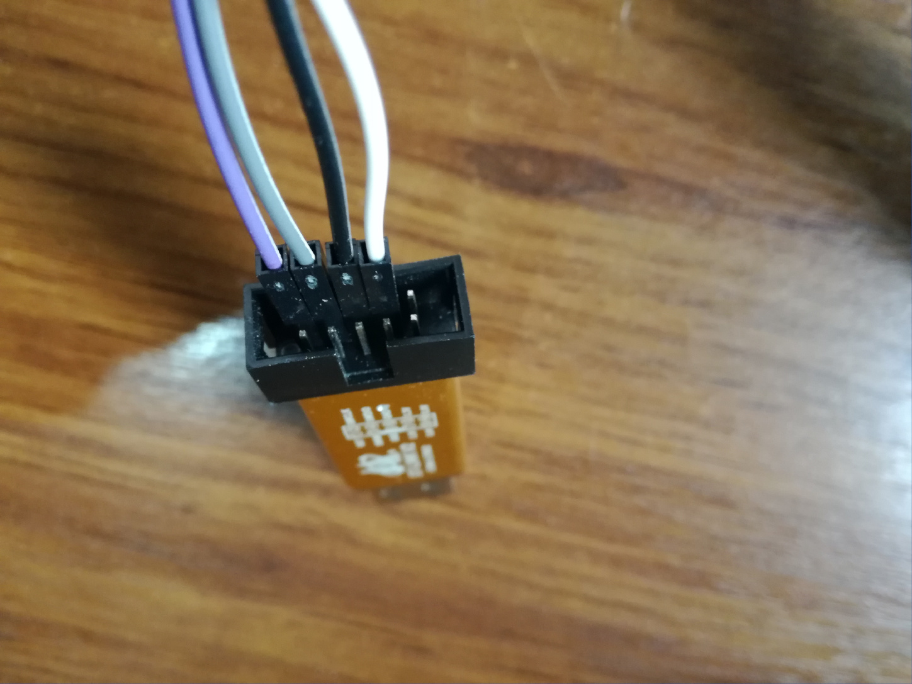

# Firmware

The firmware that makes Venabili work is actually made of two parts:
the *bootloader* and the *main firmware*, where the actual useful stuff is.

When the microcontroller is brand-new, you need to flash both parts on it using
special (although very inexpensive) hardware. After that, only new versions of
the *main firmware* need to be flashed whenever you change your layers, macros,
etc; And the special programming hardware is no longer needed, you can do it
pretty easily and quickly with your keyboard plugged in as normal.

Throughout these documents, the process of flashing for the first time with
special hardware will be known as *"low level"* flashing. And the process of
flashing the main firmware each time you want to change your keyboard's
behaviour as *"user level"* flashing.

Because we're still building the keyboard, we're only going to address the
first-time-only low level flashing here and let the user level flashing for the
[Customizing Guide](customizing.md).


## Preparing the software

We're gonna need the latest version of the Venabili's firmware and the
compiler/tools to build it and flash it to the controller board.

The process will be described assuming you're on a \*NIX Operating System
(Linux, BSDs, Mac OS, etc), this will not work on Windows.


### Tools

#### GCC ARM port

Some package managers will make it available as a set of packages:

- arm-none-eabi-gcc
- arm-none-eabi-bintuils
- arm-none-eabi-newlib

Others will bundle all this in some repository. In Ubuntu, for instance you can
get it with:

```
$ sudo add-apt-repository ppa:team-gcc-arm-embedded/ppa
$ sudo apt-get update
$ sudo apt-get install gcc-arm-none-eabi
```

#### stlink (Low level flashing software)

For this you can follow its own installation guide here:
https://github.com/texane/stlink#installation

#### dfu-util (User level flashing software)

This on is available in most package managers. Alternatively refer to the
project page: http://dfu-util.sourceforge.net/


### Firmware

Either clone the Venabili's code repository from here:
https://github.com/alx741/venabili or download a ZIP package of it here:
https://github.com/alx741/venabili/archive/master.zip

The only two directories you care about right now are `bootloader` and `src`.


## Compiling

While in the Venabili source code directory, run:

```
$ cd lib/libopencm3
$ make
$ cd ../../bootloader
$ make
$ cd ../../src
$ make
```

If no errors are reported you're done, if something complains along the way is
likely you're tools are not installed properly.


## Preparing the connections

Start by connecting the *ST-LINK* to the bottom pin header of the controller
board. Make sure you use the `3.3v` of the *ST-LINK*.

* STM32 Board   <-->   ST-LINK
*   GND         <-->     GND
*   CLk         <-->    SWDCLK
*   IO          <-->    SWDIO
*   3.3         <-->    3.3v


**Warning** (avoiding the magic smoke)

- Do not use the `5v` pin of the *ST-LINK* for this process
- Do not connect the board USB port to anything for this process





## Low level flashing

Connect the *ST-LINK* (NOT the controller board) to a USB port on your computer.

While in the Venabili source code directory a, run:

```
$ cd bootloader
$ make burn
$ cd ../src
$ make burn_low
```

If no errors are reported then you're done with the flashing and ready to use
the controller board on your keyboard.
