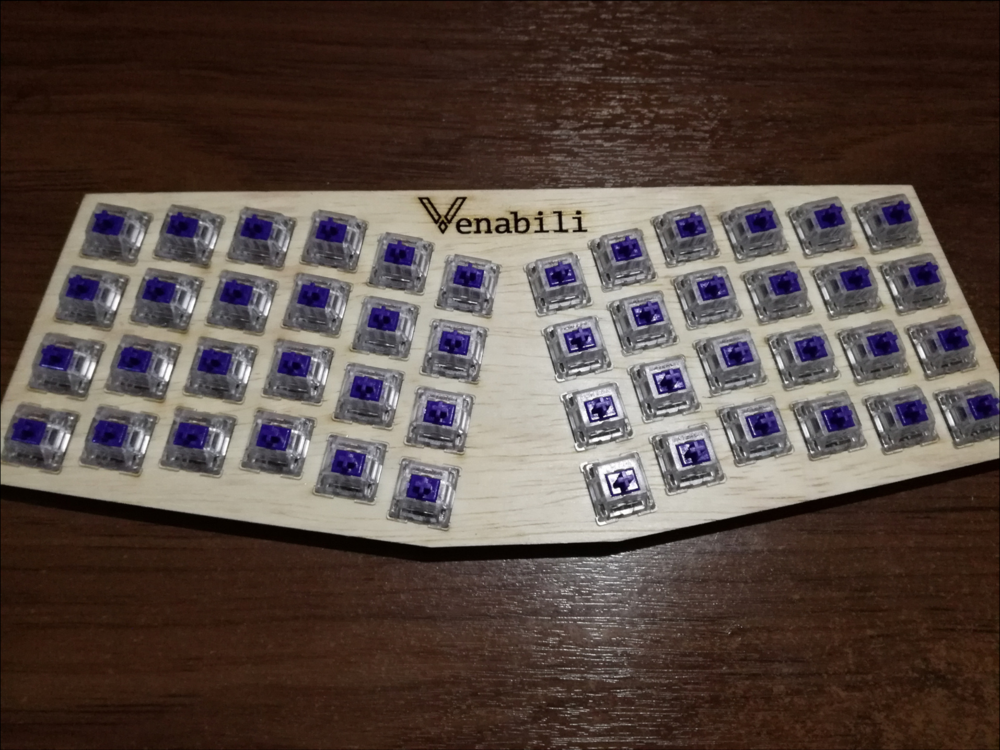
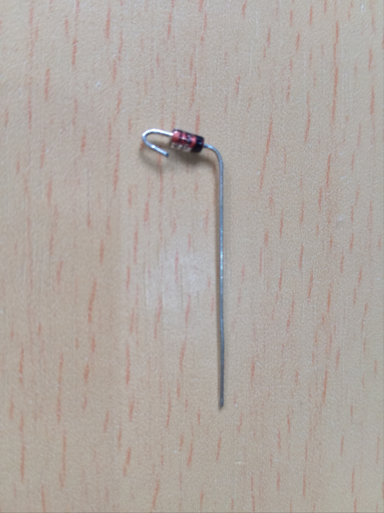
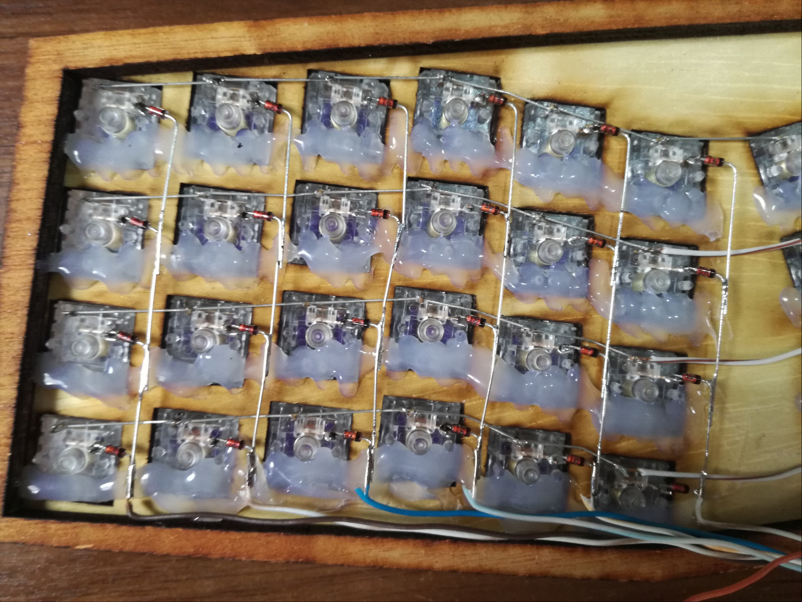
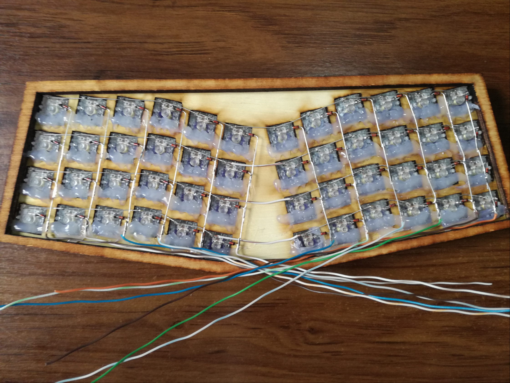

# Hardware

Now is when we actually build it: First we're gonna need a case to put the
switches on, then we need to solder the switches with some diodes and onto the
controller board.

During the building process, always refer to the circuit diagram below.

## Case

The case is made of a 4-piece sandwich of the material of your choice.

Here are the pieces as real scale PDFs, ready to take to the laser cutter for
instance.

- [Top](./case/top.pdf)
- [Middle 1](./case/middle1.pdf)
- [Middle 2](./case/middle2.pdf)
- [Bottom](./case/bottom.pdf)

### Customizing

The default design is a 24deg fixed-split, 3mm vertically staggered layout; You
can change it at will by modifying the [SVG vector
design](https://github.com/alx741/venabili/blob/master/design/layout.svg).

## MCU preparation

The *BluePill* board has this yellow pin headers that will get in the way, so
start by desoldering those:

Now put a solder bridge between the upper pads to make up for the removed jumper
caps:

Desolder the reset push button as well, then solder the USB connector (follow
the circuit diagram), and finally solder a *1.8k* resistor between the
`PA12` and `3.3V` pads (I've used a 1k and 0.8k resistors in series).

## Wiring

Once you have the case pieces ready, put the switches in. It's a good idea to
hold them in place with some hot glue, so they don't pop out when replacing key
caps.

Bend the diodes like this:

And use them to connect the switches in columns:

Solder wires to the bottoms of each column like so:

Now put a 3mm LED in one of the switches, together with a `330 ohm` resistor and
make sure to isolate it:

### MCU wiring

Now is just a matter of following the circuit diagram to solder the right wires
on the right pads:

You might want to trim the flashing pin header at the bottom of the board to
have an easy fit inside the case, but don't get rid of them completely as you
might need them in the future if you manage to brick the bootloader when hacking
it :)
